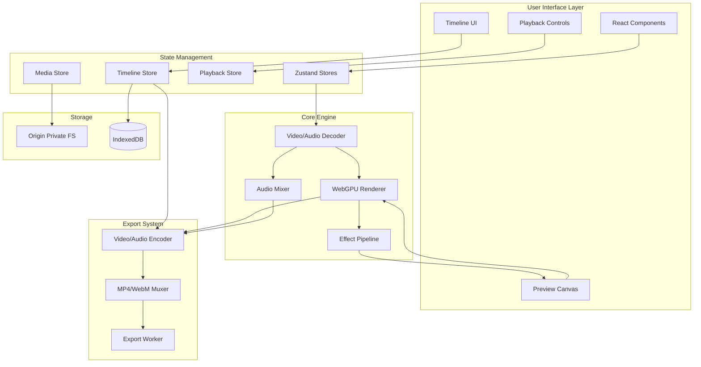

# WebCapCut - Technical Architecture

## System Overview

WebCapCut is a browser-based video editor leveraging cutting-edge web APIs to deliver near-native performance for video editing tasks.



---

## Core Components

### 1. WebGPU Rendering Pipeline

#### Architecture
```
VideoFrame → GPU Texture → Shader Pipeline → Canvas
```

#### Key Classes

**WebGPUContext**
- Singleton managing GPU device and context
- Handles device initialization and recovery
- Provides shared resources (command encoder, render pass)

**CanvasRenderer**
- Main render loop using `requestAnimationFrame`
- Converts `VideoFrame` to GPU texture via `importExternalTexture()`
- Executes shader pipeline for each frame
- **Critical:** Calls `frame.close()` to release VRAM

**EffectPipeline**
- Chains multiple effects (color correction, blur, transform)
- Uses ping-pong textures for multi-pass effects
- Optimizes by combining compatible shaders

#### WGSL Shaders

**video.wgsl** (Basic passthrough)
```wgsl
@group(0) @binding(0) var videoTexture: texture_external;
@group(0) @binding(1) var videoSampler: sampler;

@fragment
fn main(@location(0) texCoord: vec2<f32>) -> @location(0) vec4<f32> {
    return textureSampleBaseClampToEdge(videoTexture, videoSampler, texCoord);
}
```

**colorCorrection.wgsl**
```wgsl
struct ColorParams {
    brightness: f32,
    contrast: f32,
    saturation: f32,
    hue: f32,
}

@group(0) @binding(2) var<uniform> params: ColorParams;

// Apply color adjustments in fragment shader
```

---

### 2. WebCodecs Integration

#### Video Decoding Flow

```
MP4 File → mp4box.js → Video Samples → VideoDecoder → VideoFrame → GPU Texture
```

**VideoDecoder Class**
```typescript
class VideoDecoder {
    private decoder: VideoDecoder;
    private frameBuffer: VideoFrame[] = [];
    
    async init(file: File) {
        // Parse MP4 with mp4box.js
        const mp4box = MP4Box.createFile();
        mp4box.onReady = (info) => {
            const videoTrack = info.videoTracks[0];
            
            // Configure decoder
            this.decoder = new VideoDecoder({
                output: (frame) => this.frameBuffer.push(frame),
                error: (e) => this.handleError(e),
            });
            
            this.decoder.configure({
                codec: videoTrack.codec,
                codedWidth: videoTrack.video.width,
                codedHeight: videoTrack.video.height,
            });
            
            // Start extracting samples
            mp4box.setExtractionOptions(videoTrack.id);
        };
        
        mp4box.onSamples = (trackId, samples) => {
            for (const sample of samples) {
                this.decoder.decode(new EncodedVideoChunk({
                    type: sample.is_sync ? 'key' : 'delta',
                    timestamp: sample.cts,
                    duration: sample.duration,
                    data: sample.data,
                }));
            }
        };
    }
    
    getFrameAt(timestamp: number): VideoFrame | null {
        // Find closest frame to timestamp
        return this.frameBuffer.find(f => 
            Math.abs(f.timestamp - timestamp) < 16666 // ~1 frame tolerance
        );
    }
}
```

#### Audio Decoding Flow

```
MP4 File → mp4box.js → Audio Samples → AudioDecoder → AudioData → Web Audio API
```

**AudioDecoder Class**
```typescript
class AudioDecoder {
    private decoder: AudioDecoder;
    private audioContext: AudioContext;
    private sourceNode: AudioBufferSourceNode;
    
    async init(file: File) {
        // Similar to VideoDecoder but outputs AudioData
        this.decoder = new AudioDecoder({
            output: (audioData) => this.bufferAudio(audioData),
            error: (e) => this.handleError(e),
        });
        
        // Configure with audio track info
        this.decoder.configure({
            codec: 'mp4a.40.2', // AAC
            sampleRate: 48000,
            numberOfChannels: 2,
        });
    }
    
    private bufferAudio(audioData: AudioData) {
        // Convert AudioData to AudioBuffer for Web Audio API
        const buffer = this.audioContext.createBuffer(
            audioData.numberOfChannels,
            audioData.numberOfFrames,
            audioData.sampleRate
        );
        
        // Copy data to buffer
        for (let ch = 0; ch < audioData.numberOfChannels; ch++) {
            const channelData = new Float32Array(audioData.numberOfFrames);
            audioData.copyTo(channelData, { planeIndex: ch });
            buffer.copyToChannel(channelData, ch);
        }
        
        audioData.close(); // Release memory
    }
}
```

---

### 3. Timeline State Management

#### Zustand Store Structure

```typescript
interface TimelineState {
    tracks: Track[];
    clips: Map<string, Clip>;
    currentTime: number;
    duration: number;
    zoom: number; // pixels per second
    
    // Actions
    addClip: (clip: Clip) => void;
    removeClip: (clipId: string) => void;
    moveClip: (clipId: string, newTrackId: string, newStartTime: number) => void;
    trimClip: (clipId: string, trimStart: number, trimEnd: number) => void;
    
    // Selectors (computed)
    getClipsAtTime: (time: number) => Clip[];
    getActiveClips: () => Clip[];
}

const useTimelineStore = create<TimelineState>((set, get) => ({
    tracks: [],
    clips: new Map(),
    currentTime: 0,
    duration: 0,
    zoom: 100,
    
    addClip: (clip) => set((state) => ({
        clips: new Map(state.clips).set(clip.id, clip),
    })),
    
    // Transient updates for currentTime (no re-render)
    setCurrentTime: (time) => {
        get().currentTime = time; // Direct mutation
        // Notify only specific subscribers
    },
}));
```

#### Timeline Virtualization

Only render clips visible in viewport:

```typescript
function Timeline() {
    const { tracks, clips, zoom } = useTimelineStore();
    const scrollLeft = useScrollPosition();
    const viewportWidth = useViewportWidth();
    
    // Calculate visible time range
    const startTime = scrollLeft / zoom;
    const endTime = (scrollLeft + viewportWidth) / zoom;
    
    // Filter clips in viewport
    const visibleClips = Array.from(clips.values()).filter(clip =>
        clip.startTime < endTime && 
        (clip.startTime + clip.duration) > startTime
    );
    
    return (
        <div className="timeline">
            {visibleClips.map(clip => (
                <ClipItem key={clip.id} clip={clip} />
            ))}
        </div>
    );
}
```

---

### 4. Audio Synchronization

#### Challenge
Video frames are decoded on-demand, but audio must play continuously.

#### Solution: AudioWorklet + Shared Timeline

```typescript
// Main thread
class AudioMixer {
    private context: AudioContext;
    private worklet: AudioWorkletNode;
    
    async init() {
        this.context = new AudioContext({ sampleRate: 48000 });
        await this.context.audioWorklet.addModule('audio-processor.js');
        
        this.worklet = new AudioWorkletNode(this.context, 'timeline-processor');
        this.worklet.connect(this.context.destination);
    }
    
    play(startTime: number) {
        this.worklet.port.postMessage({
            type: 'play',
            startTime,
            clips: this.getAudioClipsAtTime(startTime),
        });
    }
}

// audio-processor.js (AudioWorklet)
class TimelineProcessor extends AudioWorkletProcessor {
    process(inputs, outputs, parameters) {
        const output = outputs[0];
        const currentTime = this.getCurrentTime();
        
        // Mix audio from all active clips
        for (const clip of this.activeClips) {
            const clipTime = currentTime - clip.startTime;
            const samples = this.getClipSamples(clip, clipTime);
            
            // Mix into output buffer
            for (let ch = 0; ch < output.length; ch++) {
                for (let i = 0; i < output[ch].length; i++) {
                    output[ch][i] += samples[ch][i] * clip.volume;
                }
            }
        }
        
        return true; // Keep processing
    }
}
```

---

### 5. Export Pipeline

#### Workflow

```
Timeline → Render Loop → VideoEncoder → EncodedVideoChunk
                       → AudioEncoder → EncodedAudioChunk
                                      → Muxer → MP4 File
```

#### Implementation

```typescript
class ExportManager {
    private videoEncoder: VideoEncoder;
    private audioEncoder: AudioEncoder;
    private muxer: Muxer;
    
    async export(config: ExportConfig) {
        // Initialize encoders
        this.videoEncoder = new VideoEncoder({
            output: (chunk, metadata) => this.muxer.addVideoChunk(chunk, metadata),
            error: (e) => this.handleError(e),
        });
        
        this.videoEncoder.configure({
            codec: 'avc1.42E01E', // H.264 Baseline
            width: config.width,
            height: config.height,
            bitrate: config.bitrate,
            framerate: config.framerate,
        });
        
        // Initialize muxer
        this.muxer = new Muxer({
            target: new FileSystemWritableFileStream(),
            video: {
                codec: 'avc',
                width: config.width,
                height: config.height,
            },
            audio: {
                codec: 'aac',
                sampleRate: 48000,
                numberOfChannels: 2,
            },
        });
        
        // Render loop
        const totalFrames = Math.ceil(this.duration * config.framerate);
        for (let i = 0; i < totalFrames; i++) {
            const timestamp = (i / config.framerate) * 1_000_000; // microseconds
            
            // Render frame at this timestamp
            const frame = await this.renderFrameAt(timestamp / 1000);
            
            // Encode
            this.videoEncoder.encode(frame, { keyFrame: i % 60 === 0 });
            frame.close();
            
            // Report progress
            this.onProgress(i / totalFrames);
        }
        
        // Flush and finalize
        await this.videoEncoder.flush();
        await this.audioEncoder.flush();
        this.muxer.finalize();
    }
    
    private async renderFrameAt(time: number): Promise<VideoFrame> {
        // Get all clips at this time
        const clips = this.timeline.getClipsAtTime(time);
        
        // Render to offscreen canvas
        const canvas = new OffscreenCanvas(this.width, this.height);
        const ctx = canvas.getContext('2d');
        
        for (const clip of clips) {
            const frame = await clip.getFrameAt(time - clip.startTime);
            ctx.drawImage(frame, clip.x, clip.y, clip.width, clip.height);
            frame.close();
        }
        
        // Convert canvas to VideoFrame
        return new VideoFrame(canvas, { timestamp: time * 1000 });
    }
}
```

---

### 6. Memory Management

#### Critical: Prevent VRAM Leaks

**Problem:** `VideoFrame` objects hold GPU memory. Forgetting to call `frame.close()` causes memory leaks.

**Solution:** Strict lifecycle management

```typescript
class FramePool {
    private pool: VideoFrame[] = [];
    private maxSize = 30; // ~0.5s at 60fps
    
    addFrame(frame: VideoFrame) {
        this.pool.push(frame);
        
        // Evict old frames
        if (this.pool.length > this.maxSize) {
            const oldFrame = this.pool.shift();
            oldFrame?.close(); // Release VRAM
        }
    }
    
    getFrameAt(timestamp: number): VideoFrame | null {
        return this.pool.find(f => 
            Math.abs(f.timestamp - timestamp) < 16666
        );
    }
    
    clear() {
        for (const frame of this.pool) {
            frame.close();
        }
        this.pool = [];
    }
}
```

#### OPFS for Large Files

**Problem:** Loading 4K video files into RAM crashes browser.

**Solution:** Stream from Origin Private File System

```typescript
async function storeInOPFS(file: File): Promise<FileSystemFileHandle> {
    const root = await navigator.storage.getDirectory();
    const fileHandle = await root.getFileHandle(file.name, { create: true });
    const writable = await fileHandle.createWritable();
    
    // Stream file to OPFS
    const stream = file.stream();
    await stream.pipeTo(writable);
    
    return fileHandle;
}

async function readFromOPFS(handle: FileSystemFileHandle): Promise<File> {
    return await handle.getFile();
}
```

---

## Performance Targets

| Metric | Target | Critical Threshold |
|--------|--------|-------------------|
| Preview FPS | 60 fps | 30 fps |
| Scrubbing Latency | < 50ms | < 100ms |
| Export Speed | 1x realtime (1080p) | 0.5x realtime |
| Memory Usage | < 2GB (1080p) | < 4GB |
| VRAM Usage | < 1GB | < 2GB |

---

## Browser API Usage Summary

| API | Purpose | Fallback |
|-----|---------|----------|
| WebGPU | GPU rendering, effects | None (required) |
| WebCodecs | Video/audio decode/encode | None (required) |
| Web Audio API | Audio mixing, playback | None (required) |
| mp4box.js | MP4 demuxing | None (required) |
| OPFS | Large file storage | IndexedDB (slower) |
| FFmpeg.wasm | Transcode unsupported formats | Manual conversion |
| Web Workers | Offload heavy tasks | Main thread (slower) |

---

## Security Considerations

1. **CORS:** All media files must be same-origin or have CORS headers
2. **COOP/COEP:** Required for SharedArrayBuffer (used by FFmpeg.wasm)
3. **OPFS:** Isolated per origin, cannot access user's file system
4. **GPU Access:** User may need to grant permission in browser settings

---

## Future Enhancements

- **Multi-threaded Decoding:** Use multiple VideoDecoders in Web Workers
- **Hardware Acceleration:** Leverage GPU for color space conversion
- **Collaborative Editing:** Real-time collaboration via WebRTC
- **Cloud Export:** Offload export to server for faster processing
- **Mobile Support:** Optimize for tablets (if WebGPU becomes available)
